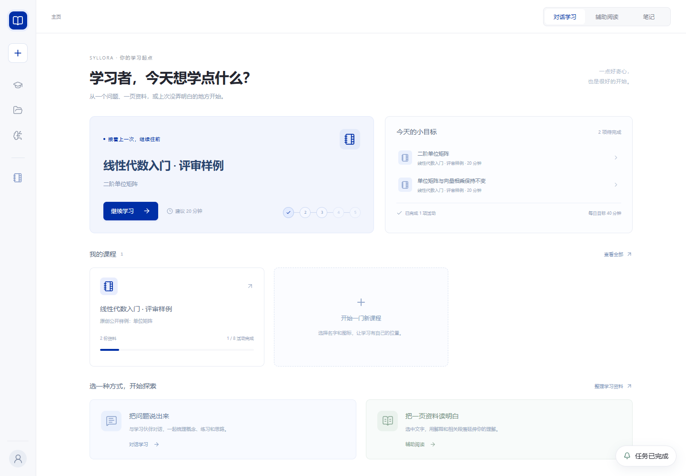
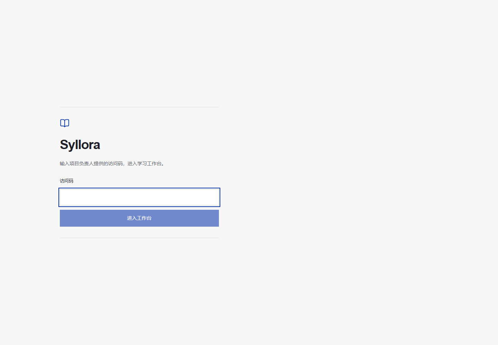

# 评审部署运行说明

用途：维护单评委浏览器实例。更新日期：2026-10-04。状态：全部功能免访问码开放，包括供应商管理。依据：已确认的 Vercel 静态前端、本机 Node Host 与 ngrok 方案，以及同步最新 main 后的部署适配。

## 入口与数据

- 评委入口：<https://syllora-review.vercel.app>。当前免访问码，直接进入；默认部署仍要求访问码，须显式启用公开模式。
- 前端通过 `NEXT_PUBLIC_SYLLORA_API_URL` 直接请求 ngrok HTTPS 的 REST、上传与 SSE。这个变量只保存公网后端域名。
- `/api/session`、`/api/session/logout`、PDF 原件、解析文档及其图片、笔记图片经过 Vercel 转发。访问码模式的会话 Cookie 是 Secure、HttpOnly、SameSite=Strict；公开模式无需凭据或 Cookie。两种模式的响应均禁止缓存。
- 虚拟课堂 RPC 和附件上传直连 ngrok；跨域预检允许上传所需的 `x-material-filename` 头。Vercel 上传排除 CLI 和桌面目录，模型及文档解析凭据留在本机后端。
- `.syllora-review/home/` 保存进程发现信息与日志；`data/` 保存独立的模型设置与凭据；`courses/` 保存课程、讲义、笔记、计划与会话。
- `.syllora-review/` 被 Git 与 Vercel 上传忽略。访问码模式的评审访问码只保存在当前浏览器标签页的 sessionStorage；退出时清除。公开模式清除旧的浏览器访问码，不将任何访问码或模型密钥写入构建。
- 普通 `pnpm serve` 沿用现有本机行为，不切换到评审数据目录。

## 启动与停止

在 PowerShell 中进入仓库根目录。首次启动需要已安装并完成认证的 ngrok，并将它加入 PATH；也可用 `-NgrokExe` 指定客户端的绝对路径。

```powershell
powershell -NoProfile -ExecutionPolicy Bypass -File scripts\review-start.ps1 -FrontendOrigin https://syllora-review.vercel.app -PublicAccess
```

后续重启沿用 `.syllora-review/runtime.json` 中的公开域名与 ngrok 路径：

```powershell
powershell -NoProfile -ExecutionPolicy Bypass -File scripts\review-stop.ps1
powershell -NoProfile -ExecutionPolicy Bypass -File scripts\review-start.ps1
```

进程以隐藏窗口启动，PID 保存在 `processes.json`。停止脚本核对进程名称和启动命令后再停止，不删除课程或设置。启动期间运行一个防止空闲休眠的辅助进程，停止实例时一并结束；评审期间保持供电、联网，不关闭笔记本盖子或主动休眠。

`-BackendOnly` 可启动纯本机后端，用于隧道认证前配置模型。默认端口 8081，监听 `127.0.0.1`。

`-PublicAccess` 显式设置 `SYLLORA_REVIEW_PUBLIC=1`，允许所有业务及供应商管理 API 无凭据访问；来源、目录和符号链接边界仍启用。该选择保存到运行配置，后续不带参数重启沿用它。公开模式不提供用户隔离，任何访客均可使用模型额度、修改共享课程和模型配置。

如需恢复访问码模式，在 PowerShell 中停止实例后调用 `& .\scripts\review-start.ps1 -PublicAccess:$false`，重新生成配置并部署前端；本机普通启动不会因评审开关而关闭鉴权。

## 获取访问码

本节适用于访问码模式；当前公开入口不需要这些步骤。

在仓库根目录，可以从 CMD 或 PowerShell 调用复制脚本，避免不同终端的语法差异：

```text
powershell -NoProfile -ExecutionPolicy Bypass -File scripts\review-copy-code.ps1
```

这条命令必须在 **PowerShell** 中运行；CMD 用户先输入 `powershell` 再运行。它将访问码复制到剪贴板，不打印到聊天或文档。

```powershell
(Get-Content ".syllora-review\home\host.json" -Raw | ConvertFrom-Json).token | Set-Clipboard
```

访问码模式下，把剪贴板内容粘贴到评审网址。后端每次重启都会生成新码，旧 Bearer 和 Cookie 同时失效，需要重新获取并登录。前端重新部署不会更换访问码。公开模式重启后无需重新登录。

## 模型与样例

本轮已在独立实例中配置 DeepSeek 官方，并经用户确认选择 `deepseek-flash`。供应商密钥由用户在本机设置页录入，不写入本说明。评委通过设置页使用当前供应商配置，也可创建课程、上传文本 PDF 或 UTF-8 MD/TXT。

“线性代数入门 · 评审样例”使用原创、可公开分享的单位矩阵文字与 PDF，整理结果来自真实模型。课程内有讲义、计划、已验证练习与笔记图片示例。现有未接入的命令执行沙箱等能力保留不可用提示。

## 构建与重新发布

后端启动成功后，生成静态部署配置：

```powershell
node scripts/review-vercel-config.mjs
$env:NEXT_PUBLIC_SYLLORA_API_URL = (Get-Content .syllora-review\runtime.json -Raw | ConvertFrom-Json).apiUrl
$env:NEXT_PUBLIC_SYLLORA_REVIEW_PUBLIC = if ((Get-Content .syllora-review\runtime.json -Raw | ConvertFrom-Json).publicAccess) { '1' } else { '0' }
pnpm typecheck
pnpm build:web
vercel deploy --prod --yes --build-env "NEXT_PUBLIC_SYLLORA_API_URL=$env:NEXT_PUBLIC_SYLLORA_API_URL" --build-env "NEXT_PUBLIC_SYLLORA_REVIEW_PUBLIC=$env:NEXT_PUBLIC_SYLLORA_REVIEW_PUBLIC"
```

本机若没有全局 Vercel CLI，可以用已安装的 CLI 路径调用 `node <CLI路径> deploy ... --global-config <已认证目录>`。根目录 `vercel.json` 明确使用静态站点、`pnpm build:web` 和 `apps/web/out`；Vercel 构建安装 web 及 chat-service 的依赖，因为阅读选区解析复用了后者的 Markdown 模块。配置参考 [Vercel 官方说明](https://vercel.com/docs/project-configuration/vercel-json)。

配置生成脚本同时设置构建期 API 地址与公开模式标记；后端和前端开关须一致。若 ngrok 域名变化或切换公开模式，重新生成配置、构建并部署。若 Vercel 生产域名变化，用新的 `-FrontendOrigin` 重启后端；访问码模式需重新登录。不要把不确定的预览域名或通配域名加入允许来源。

## 检查与恢复

- 状态：查看 `processes.json`，或访问 ngrok 的 `/api/health`（只返回健康状态）。
- 日志：`.syllora-review/backend.stdout.log`、`backend.stderr.log`、`tunnel.stdout.log`、`tunnel.stderr.log`、`keepawake.stderr.log`；详细 Host 日志在 `home/logs/`。日志为本机诊断资料，分享前先去除凭据。
- 断网：保留课程和输入，不重复点击生成。重新联网后刷新状态，使用原任务 ID；前端现有幂等请求机制保留原请求 ID，生成与提交重试不会重复调用或计分。
- 模型失败：查看任务失败原因、供应商余额和模型配置；已保存内容保留。取消只结束指定任务。
- 资料整理采用最新 main 的摘要提炼、讲义和课件流程；失败反馈、引用核验与重试策略随主分支实现。DocMind 凭据配置成功时走阿里云解析；未配置或云端明确不支持该格式时本地回退，并显示原因。
- 后端退出：先停止记录的进程，再重新启动；旧运行中任务会明确标记进程中断。已经发布的讲义与记录保留。
- 公网 401：访问码模式重新复制当前码登录；公开模式核对前后端配置是否一致。403：检查确切生产来源配置。无法连接：先核对本机后端与隧道日志。

评审模式仅允许访问 `courses/` 的真实路径；目录选择、工作区注册、导入路径及 Agent 文件工具均检查目录边界和符号链接。评委共享同一个评审实例的数据，不是多用户产品部署。

## 页面示例

当前公开模式直接进入学习首页：



可选的访问码模式登录页（截图未包含访问码或课程资料；当前公开模式跳过该页）：



## 设计参考

参考 [Open WebUI 的显式认证开关](https://github.com/open-webui/open-webui/blob/main/backend/open_webui/env.py) 与 [AnythingLLM 的单用户认证中间件](https://github.com/Mintplex-Labs/anything-llm/blob/master/server/utils/middleware/validatedRequest.js)。两者均在持续维护；这里只采用可选公开模式的思路，沿用 Syllora 的 Next.js/Node 架构，不引入其依赖或复制源码。AnythingLLM 为 MIT；Open WebUI 当前不是标准 SPDX 许可证标识，因此不直接复用其实现。Syllora 要求显式设置评审公开开关，避免凭据配置缺失导致普通本机模式意外免认证。
