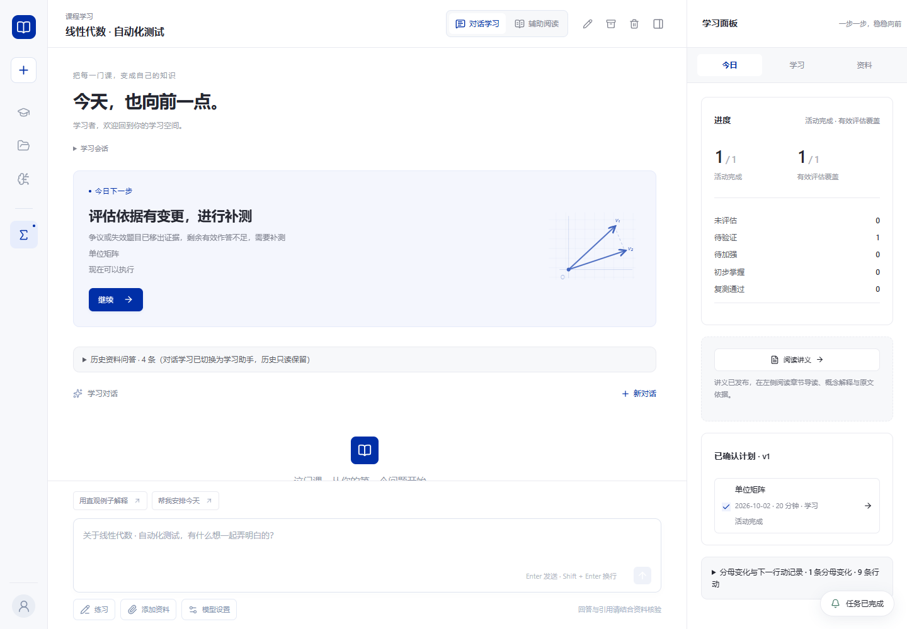
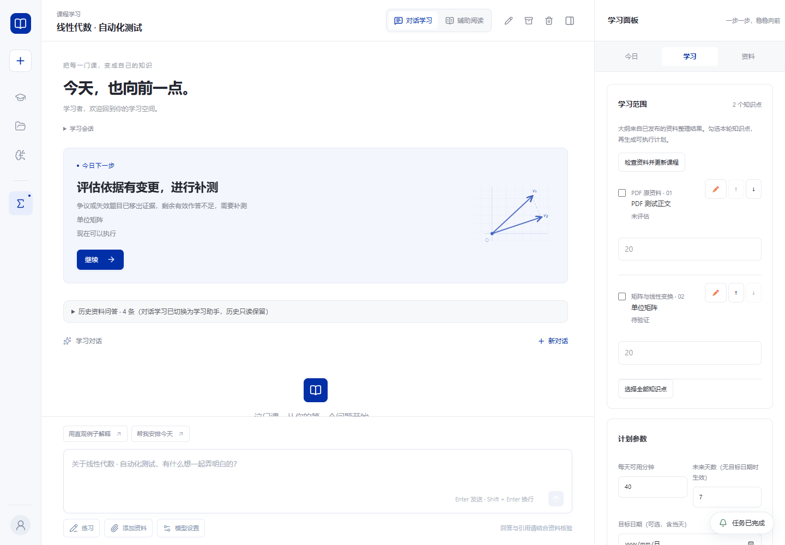
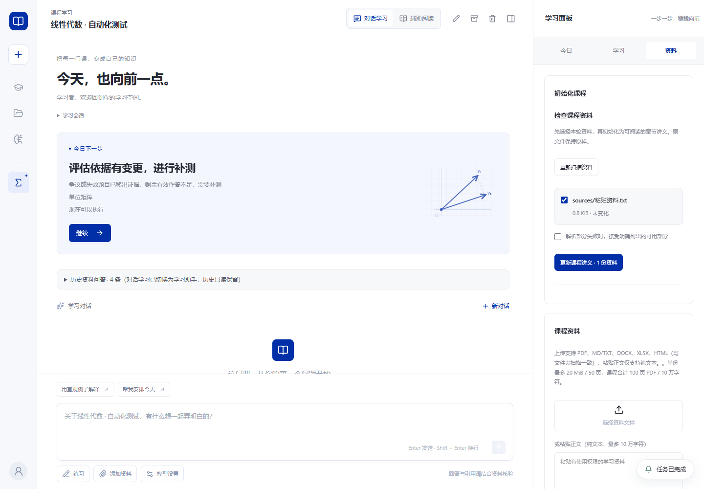
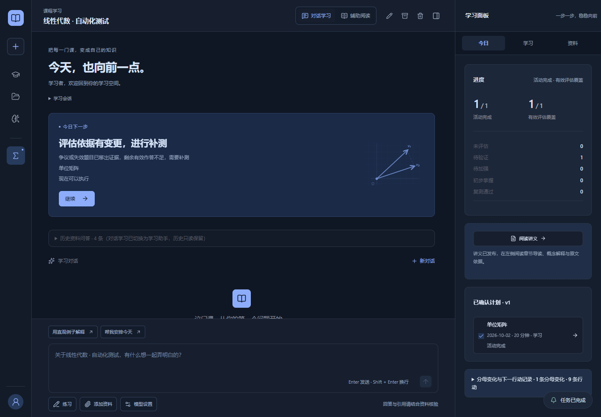
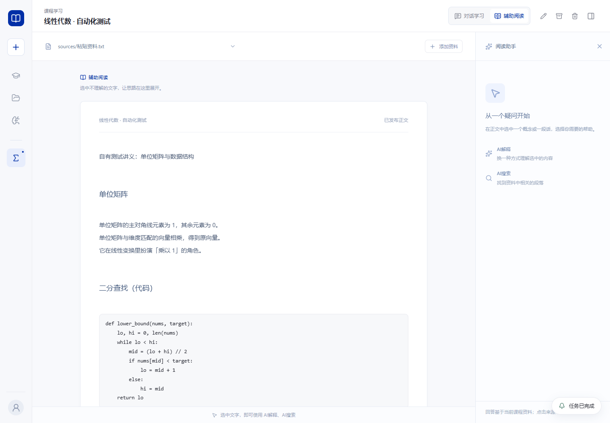
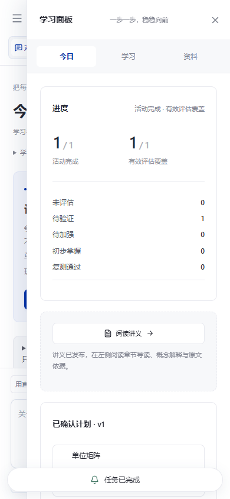

# 工作台体验修复与收尾验收

用途：随代码保留本轮交付内容、复验方法、兼容性和未验证项。
日期：2026-10-02。状态：本地检查通过，待 PR 评审；不代表完整产品 PRD 冻结或发布签核。
依据：工作区方案 `workbench-ux-prd-2026-10-02.md`、分支 `fix/workbench-ux-and-defects-from-prd` 的已有提交与接续修复，以及本轮实际运行结果。运行与构建不需要访问工作区方案或临时目录。

## 交付与需求对应

| 需求 | 最终行为 | 验证依据 |
| --- | --- | --- |
| 一：课程折叠与排序 | 左栏按可用高度显示课程，溢出进入可搜索选择器；拖拽与上移/下移写同一顺序，归档课程不占左栏 | `sidebar-course-order.test.tsx`、项目顺序持久化测试 |
| 二：精简入口 | 移除重复的「学习工作台」导航；课程图标、主页与课程页仍可进入学习 | 组件测试、浏览器截图 |
| 三：面板重构 | 今日 / 学习 / 资料三组，沿用工作台字体、控件与暗色令牌；讲义入口在今日，中栏阅读能力保留 | `study-panel-structure.test.tsx`、两协议联调、浅色/暗色/移动端截图 |
| 四：缺陷修复 | B 系列及明确编号的 CR-01–22 对应实现见下表；M1–M10 确认项单独保留 | 全量测试及专项回归 |
| 五：通知胶囊 | 右下角统一承接任务进度、取消、失败与诊断，中栏旧进度条移除 | `notification-capsule.test.tsx`、浏览器联调与截图 |
| 六：初始化性能 | 默认整理并发 3、解析并发 2；限流实际降低调用并发；完成计数、耗时、ETA；PDF 在 worker 中解析，60 秒上限，页码保留 | `syllora-initialize-perf.spec.ts`、`pdf-worker.spec.ts`、真实 Host 的 PDF 初始化联调 |
| 七：供应商配置 | 预设、连接测试、激活、排序与结构导入导出；导出不含密钥；共享配置根与凭据按供应商解析 | `provider-config-ux.spec.ts`、凭据隔离回归、设置保存联调 |

## B 系列

| 编号 | 修复与兼容性 | 验证 |
| --- | --- | --- |
| B1 | 工作台聊天以课程 UUID 标识；同名文件夹互不串课。宿主仍接受同目录的旧 basename 身份，会话日志保留在原课程目录，无须复制历史 | `agent-chat.test.tsx`、`course-identity.spec.ts` |
| B2 | 服务不可用时先阻止切换，提供「保留草稿并切换」；缓存保留，后台保存失败继续重试，成功才移出待保存集合 | `course-switch-recovery.test.tsx` |
| B3 | 普通切课回今日，并清理来源/差异弹窗、讲解任务等；新建/打开课程、上传与失败通知的资料入口仍保留；失败通知也先保存当前草稿 | 切课回归与浏览器新建/导入联调 |
| B4 | 展示课程与聊天 store 未同步时禁止提交，并在提交瞬间再次校验 | 聊天组件回归、UUID 桥接测试 |
| B5 | 阅读任务等待 60 秒提示仍查询原任务，150 秒停止轮询并请求取消；保留选区与重试入口 | `reading-timeout.test.ts` |
| B6 | 溢出入口复用 CoursePicker；删除无使用的工作台菜单分支。CourseMenu 在 Catalog 中有真实消费者，保留课程列表菜单 | 引用检查、类型检查、全量测试 |
| B7 | 足迹按课程时区归日；日历轴用日期运算，保留原始活动时间戳 | `activity-timezone.test.ts` |
| B8 | 本分支此前已接入 DOCX/XLSX/HTML 上传和扫描；提示按实际格式对齐，粘贴仍限文本 | 材料格式测试、资料面板截图；与早期方案「上传仅三种格式」的假设不同 |
| B9 | 顶栏与导航统一为「复习与巩固」 | 组件检查 |
| B11 | code 原样 pre/code、table 使用 GFM、list/paragraph 保软换行；保留强调、来源定位与选区，未启用原始 HTML | `reading-format.test.tsx`、多章节阅读联调与截图 |

方案未定义 B10，本记录不补造编号。

## CR 系列

| 编号 | 最终处理 | 验证依据 |
| --- | --- | --- |
| CR-01 / CR-15 | 共用断连监听器，区分正常请求体完成与真实断连；响应关闭也取消 SSE；四入口注册在请求处理开始 | `client-disconnect.spec.ts`：真实 HTTP 上传/正常 SSE/中途断开，`serve-http.spec.ts` |
| CR-02 | 工具执行入口复核模式白名单 | `security-batch0.spec.ts` 模式越权回归 |
| CR-03 / CR-17 | 写笔记和文件拒绝符号链接/悬空链接，并校验真实路径归属 | 安全回归 |
| CR-04 | 队列带课程/会话归属，切换与新建会话丢弃旧队列 | 会话及聊天 hook 回归 |
| CR-05 | 同工作区、同 evalId 的在途请求串行；完整账本落盘后重放，不跨工作区去重 | `eval-idempotent-and-job-dedup.spec.ts` 并发、跨实例、跨工作区测试 |
| CR-06 | Agent fetch_url 复用安全抓取与审批规格 | 安全抓取及工具规格回归 |
| CR-07 | 主密钥先写完整私有临时文件，再原子且不覆盖地发布；失败者读取胜者；损坏密钥不覆盖，启动解密告警不输出输入或密钥 | `credential-isolation.spec.ts` 32 并发、损坏文件与日志脱敏 |
| CR-08 | 仅按供应商 id/apiKeyEnv/兼容命名解析，禁止借用无归属 default | 单/多供应商凭据隔离测试 |
| CR-09 | 普通对话、Agent 与自动标题统一读取 configRoot；实际配置传入 Agent，避免回落课程目录 | 配置回归、设置及两协议联调 |
| CR-10 | 资料 revision 缺失时明确提示重新初始化，不提交无效阅读任务 | 阅读服务回归 |
| CR-11 | ask 回答失败重试仍走 answer，复用 requestId，不追加重复用户消息 | `batch7-chat-regressions.test.tsx` |
| CR-12 | answer 中间帧、延迟刷新、成功与失败终态均校验课程/会话归属；请求 id 也绑定归属 | 旧流尾帧成功/失败、跨会话相同回答回归 |
| CR-13 | 每条失败卡固化对应 retryText | `chat-area-retry-text.test.tsx` |
| CR-14 | 项目索引 load 失败清除 ready，修复文件后同实例可重试 | `syllora-projects.spec.ts` |
| CR-16 | 匿名 HTML 与 HTTP 接口均不返回 token，原匿名 host-config 入口返回 401；浏览器启动链接 fragment 换 HttpOnly/SameSite Cookie 后清除；桌面由主进程换票，renderer/preload 不接收 token | Host HTTP 合约、浏览器联调、桌面整机/sidecar 冒烟 |
| CR-18 / CR-19 | 网页 body 与 LSP 输出加入模型数据投影 | 安全批次模型投影测试 |
| CR-20 | 读写笔记统一 v2 状态目录 | 工具笔记布局回归 |
| CR-21 | 来源与 fileContext 按真实路径校验，不允许链接逃逸 | 安全来源回归 |
| CR-22 | 扫描排除集不依赖无人写入的 source-root 标记 | 排除 node_modules/其他课程状态目录回归 |

## 实际运行结果

环境：Windows、本仓库依赖；本地模型夹具明确为 synthetic，付费模型调用为 0。

| 检查 | 结果 |
| --- | --- |
| 全仓 `pnpm exec vitest run --maxWorkers=2` | 172 个测试文件通过，1572 个测试通过、5 个跳过；jsdom 的导航未实现提示不计为通过的导航测试 |
| 最后切课调整后的专项回归 | 聊天、切课与通知 4 文件、20 测试通过 |
| `pnpm typecheck` | 通过 |
| `pnpm build:web` | 生产静态导出通过 |
| CLI TypeScript 构建与 `build:bundle` | 通过 |
| 桌面资源 assemble | 通过；未生成安装包或发布版本 |
| OpenAI 兼容协议 + 已构建 CLI bundle | `workbench-e2e.ts` 通过 |
| Anthropic 协议 + 源码 Host | 同脚本通过 |
| `node apps/desktop/scripts/smoke-desktop.mjs` | 窗口加载、会话授权、匿名无密钥、优雅退出通过，sidecar 残留 0 |
| `node apps/desktop/scripts/smoke-sidecar.mjs` | 嵌入式 Node、设置保存、强杀后第二次启动自愈通过 |
| `git diff --check` | 通过 |

浏览器联调覆盖：新建目录课程、设置编辑、含代码/表格/软换行的资料导入、多章节初始化、讲义来源、指定知识点的计划草案与确认、专注学习、两个独立作答与服务器判分、错题及争议、阅读选区解释、归档恢复、刷新持久化、三组面板、移动抽屉开关、旧进度条移除，以及两页 PDF 的 worker 解析、页码锚点与版本发布。自动判分与计划规则未作为新产品规则修改。

60 章性能夹具采用每次模型调用 60ms 延迟：串行 **4908ms**，并发 3 **1843ms**，比值 **0.3755**，峰值并发 **3**，满足该夹具下不高于串行一半的门槛。增加乱序完成仍保持原章节/知识点顺序、限流后实际峰值降为 1，以及解析完成计数不回退的断言。这些数据不代表真实供应商或扫描 PDF 的性能。

一次全仓测试与生产构建、双浏览器同时运行时，供应商导入 UI 的短等待失败；单独复跑该文件 26 项通过，最终全仓限制测试 worker 数复验。浏览器脚本另补首次 state 响应后的就绪等待，避免在 hydration 前点击可见按钮。

## 截图

均来自自有资料与本地模拟模型，没有真实密钥或用户资料。已目视检查三组面板、暗色、阅读代码排版与移动抽屉。阅读表格行数及软换行另有 DOM 断言。

## 兼容与后续验证

- 启动浏览器请使用终端输出的登录链接，或 `serve --open`。token 仅在链接 fragment/用户输入中临时使用；不通过匿名 HTTP 自动取回，也不写入宿主日志。桌面正常启动自动换票。
- 无归属 `default` 密钥不再回退给供应商；旧数据中只有该键时，需要在对应供应商设置重新输入 Key。按供应商 id/apiKeyEnv 保存的数据继续兼容。搬迁加密凭据时仍需保留同一主密钥。
- 主密钥的原子发布依赖本地文件系统硬链接；本轮在 NTFS 验证。网络盘或不支持硬链接的文件系统尚未验证，创建失败会明确报错，不覆盖现有密钥。
- 桌面 Playwright 完整交互联调在当前 Windows 环境启动等待超时，未进入 main.cjs。独立真实 Electron 整机冒烟通过；不能据此声称打包安装版全部交互或完整桌面 E2E 通过。
- 真实模型教学质量、真实服务限流、真实大资料性能及扫描件/复杂版面仍待人工验收；PPTX、OCR、费用/配额面板、OAuth 与自动故障转移保持方案边界。
- 方案 M1–M10 为多项待验证/待确认维护问题，并非已逐条关闭。本轮仅随明确缺陷处理涉及的日志脱敏、ask id 归属、终态守卫和笔记布局；其余域层复杂度、Windows 导入边界、DST、缓存上限、锁与 CLI 边界等保留后续核实，不写成通过。
- 本分支不合并其他并行 PR，不推送发布标签，不部署；已有初始化性能 PR 的重复改动需由评审时统一取舍。
