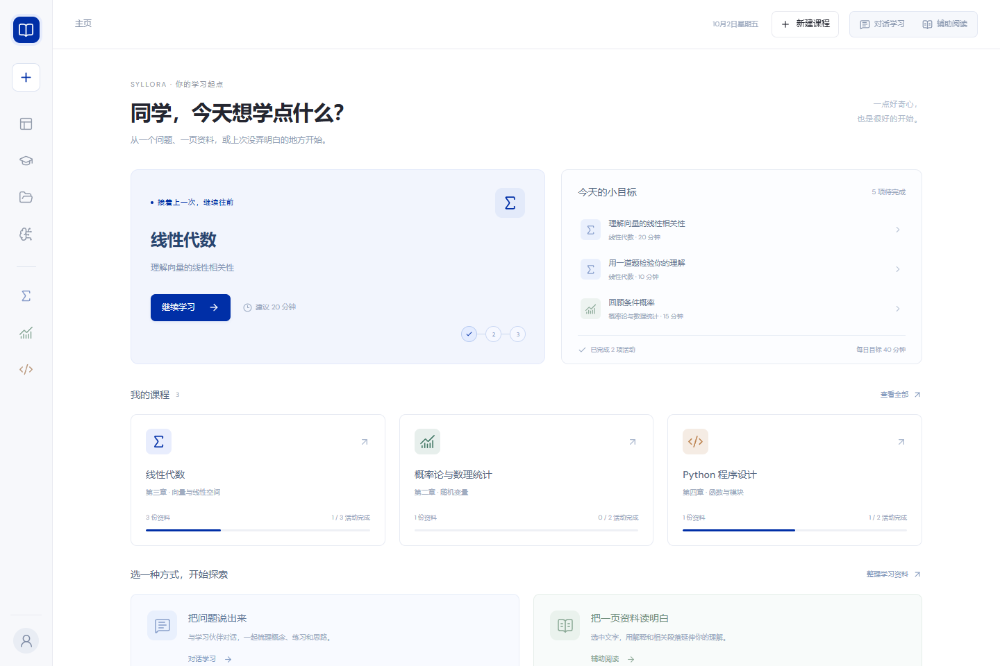
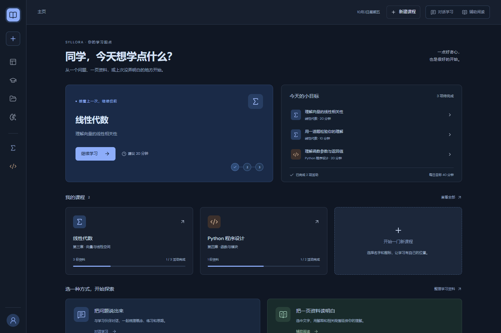
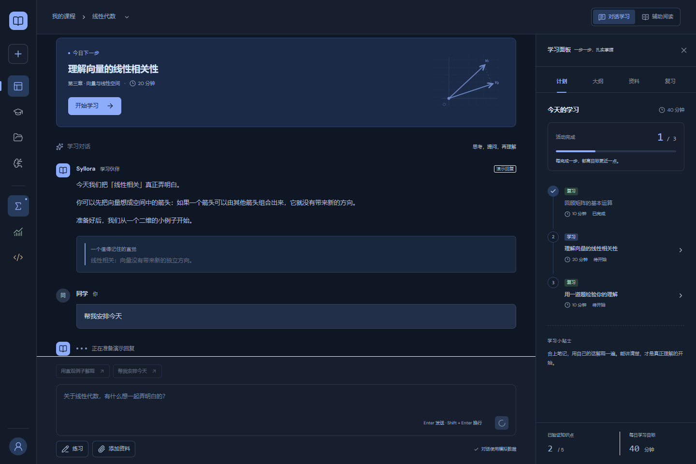
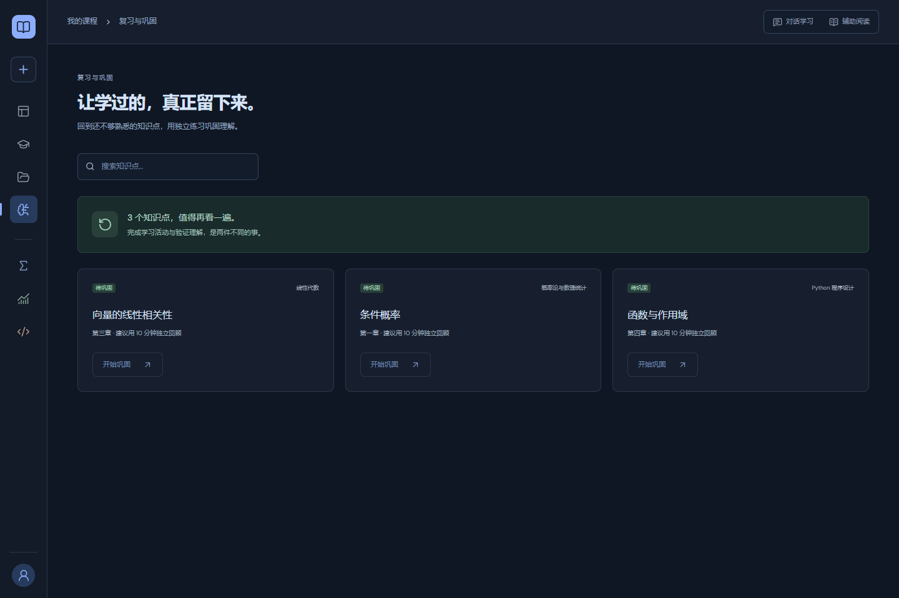
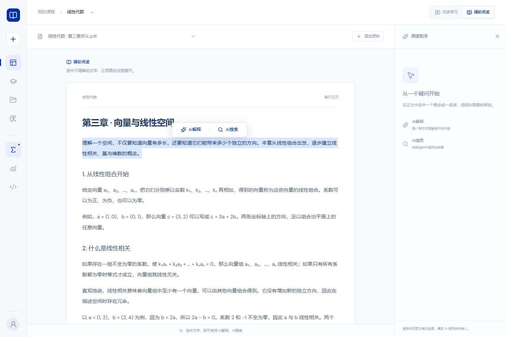
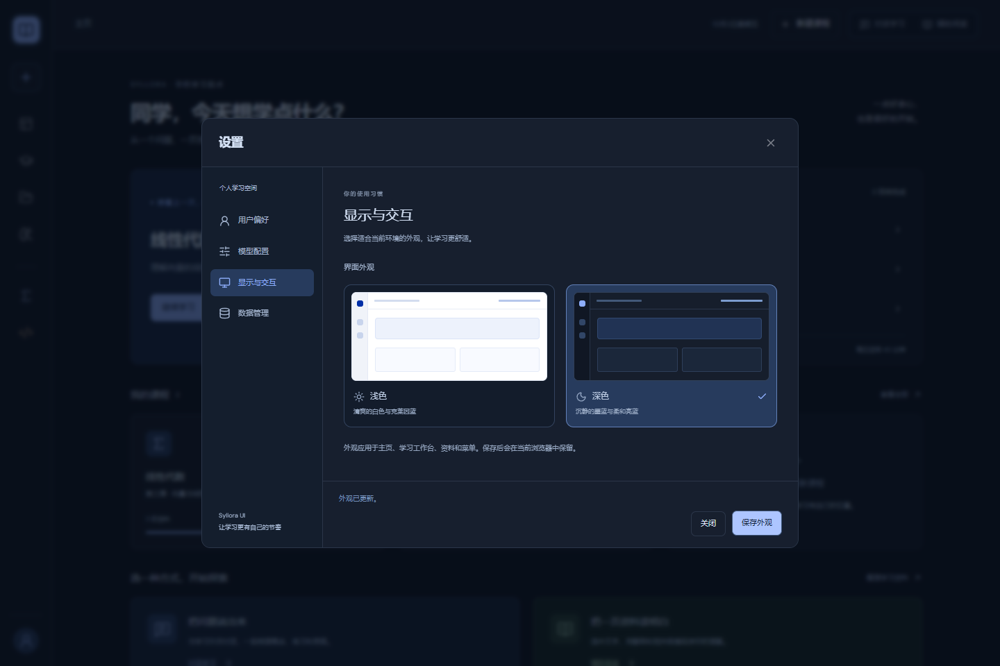
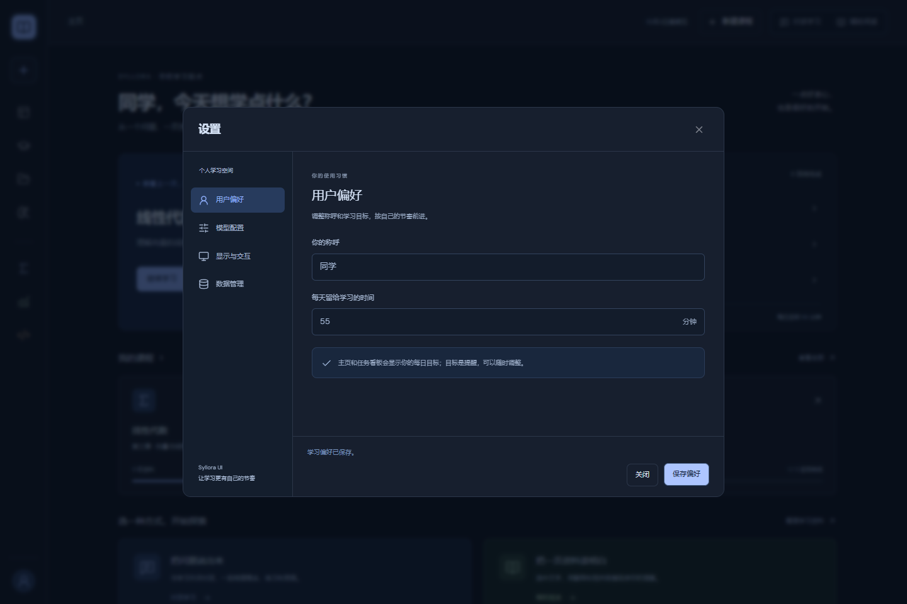

# 独立学习工作台 UI 修改报告

交付日期：2026-10-02（Asia/Shanghai）。本次将已完成的 Syllora 独立 UI 原型整理到仓库 `ui/`，用于界面评审和后续后端联调。基线为 `main` 的 `edd4ffe0e51d8cd989a1c9462752e0c223a8ddc4`，工作分支为 `feat/standalone-learning-ui`。

## 改动范围

新增独立 Next.js / React / TypeScript 工程，沿用 Syllora 的蓝色、图标导航和学习工作台视觉。源代码、锁文件、便携启动脚本、浏览器验证及文档均放在 `ui/`；仓库 README 增加入口。现有 `apps/web`、Host、领域规则、pnpm 工作区和运行数据保持原有职责；这版界面尚未接入后端，也不需要宿主注入或 Electron。

独立依赖锁定 Next.js 16.3.1、React 19.2.8、lucide-react 1.33.0、TypeScript 5.9.3。Next.js/React 用于独立静态前端与交互，lucide-react 提供统一图标，TypeScript 校验服务契约；依赖许可分别为 MIT/MIT/ISC/Apache-2.0。npm 锁文件仅用于 `ui/`，不替换仓库 pnpm 锁文件。

## 交付功能

| 区域 | 最终行为 |
|---|---|
| 主页 | 初始进入和刷新显示主页；左上应用图标返回主页，展示继续学习、课程进度、今日活动和模式入口 |
| 图标导航 | 左侧仅显示图标，悬停/键盘聚焦显示名称；用户菜单含资料、设置、帮助、退出；帮助继续展开指南与协议 |
| 我的课程 | 搜索、新建、图标必选、重命名、归档、恢复、删除确认；12 种图标保存后同步到侧栏和卡片 |
| 顶部导航 | “我的课程”进入课程目录；课程名称旁菜单依次为更换课程、课程归档、重命名；更换课程保留学习模式 |
| 对话学习 | 本地演示消息、提示词和发送状态；练习、添加资料置于输入框下方；不占用聊天输入区顶部 |
| 辅助阅读 | TXT/Markdown 正文阅读，真实选区自动出现 AI解释/AI搜索；右侧助手可收起并原位展开、保留结果 |
| 学习面板 | 计划/大纲/资料/复习标签；任务看板可收起；去除模式按钮旁重复控制，收起栏只显示展开按钮；手机可访问抽屉 |
| 学习统计 | 12 周热力图与 7/14/30 天趋势；明确区分演示与本地记录，提供排除演示记录开关 |
| 设置 | 860×620 桌面固定弹窗，左侧分类、右侧滚动；用户偏好、模型配置、显示与交互、数据管理，小屏适配 |
| 模型配置 | 接口地址、模型、格式、随机度、密钥的前端保存与格式检查；不发起真实模型调用 |
| 外观 | 可保存浅色/深色主题；页面、输入框、消息、阅读、图表、菜单、弹窗同步适配；移除紧凑显示和动画开关 |
| 菜单与转场 | 圆角、分隔间距、淡入/位移、键盘选择、Escape/外部点击；尊重系统减少动态效果 |
| 输入点击 | 使用系统箭头作为可见点击点；移除文本字段标签和框外留白的额外激活区域，保留 accessible name、输入与 Tab 操作 |

## 本轮问题修复

- 深色学习时间输入框的外层容器和单位颜色统一；“分钟”不换行，内层输入背景透明。
- 用户发送的消息气泡改为深蓝底和浅色正文，保持清晰层级。
- 复习概览“n 个知识点，值得再看一遍”改为深绿底，并调整图标、标题、说明及边框。
- 收起时删除“计划”文字和阅读助手装饰图标；桌面和手机各保留可用的展开入口。
- 模式切换按钮维持在共享顶部栏；设置取消不应用草稿外观，保存后刷新保留选择。

## 工程与接口准备

- [src/types/index.ts](../src/types/index.ts) 定义 `WorkspaceData`、课程/资料/任务/消息/偏好/活动 DTO，以及 `WorkspaceService`、`ReadingService`。
- [src/services/index.ts](../src/services/index.ts) 是后端适配器切换入口；组件经 `useWorkspace` 管理更新与错误，不直接请求业务后端。
- [backend-integration.md](backend-integration.md) 已按现有仓库代码核对两类请求信封、认证、课程/资料/Job/学习/供应商接口、字段映射和差距，并给出联调顺序。
- [README](../README.md) 提供独立安装、启动、静态构建和四套浏览器验证命令。
- Windows [start-ui.cmd](../start-ui.cmd) 以脚本相对路径定位工程，不依赖开发者的桌面或 `D:` 路径；浏览器脚本支持 `UI_URL`/`CHROME_PATH`，无系统 Chrome 时使用 Playwright Chromium。

## 验证记录

2026-10-02 在 Windows / Node.js 22.23.2 下，对本分支 `ui/` 执行以下检查。浏览器使用隔离上下文和本分支的静态 `out/` 产物（`PORT=3002`、`UI_URL=http://127.0.0.1:3002`），不读取用户实际 localStorage。

| 检查 | 结果 |
|---|---|
| `npm ci --no-audit --no-fund` | 洁净安装通过，锁文件未改变 |
| `npm run typecheck` | TypeScript 校验通过 |
| `npm run build` | 生产构建与静态导出通过 |
| `scripts/verify_ui.py` | 36 项主页、导航、资料、对话、阅读、用户及响应式检查通过 |
| `scripts/verify_revision.py` | 25 项统计、课程管理、设置、API 演示配置和面板检查通过 |
| `scripts/verify_appearance.py` | 15 项主题、菜单、收起栏、兼容与手机入口检查通过 |
| `scripts/verify_input_boundaries.py` | 11 个输入框的边界点击、箭头、键盘、保存与手机检查通过 |

浏览器套件均未发现 JavaScript 异常；基础套件同时确认没有业务 API 请求。末次深色消息与复习概览修复另已检查背景、文字/图标对比度以及手机布局和浅色样式。

现有仓库 CI 以 pnpm 工作区为范围，不能将其通过等同于 `ui/` 已通过测试。原后端未修改，本报告只记录实际执行的独立 UI 检查。

## 当前边界与后端待办

1. 聊天、解释、搜索和练习目前为本地演示；AI搜索仅找资料段落，没有联网搜索。真实模型效果、后端认证、账号退出与正式协议未接入。
2. TXT/MD（≤1 MiB）正文保存在浏览器；PDF（≤20 MiB）仅保存元数据，示例 PDF 使用明确标记的演示正文。接入上传需保留原文件字节，接入阅读需明确正文版本和锚点。
3. UI 三档知识点状态、任意任务完成切换、固定示例题，与后端五档证据和作答流程存在差距；接入时必须扩展/重构，不能靠字段改名冒充完整联调。
4. 统计分钟数是任务建议时长；聊天/阅读只计互动，不能当作真实在线时长。后端应提供真实会话或明确统计投影。
5. 当前 API 密钥仅在 sessionStorage；真实模式复用服务器供应商凭据管理。外部调用授权必须补到界面，UI 偏好不能调用仅处理 consent 的后端 preferences。
6. 默认使用 `syllora-ui.workspace.v1` 本地数据；旧 theme/icon 缺失兼容回退，compact 字段保留但不使用。真实后端 UUID 与示例 ID 不可混用，不自动将示例课程迁到服务器。

## 界面截图

下列图像由隔离演示环境生成，仅展示 UI。

### 主页

### 深色对话与复习

### 阅读与设置

